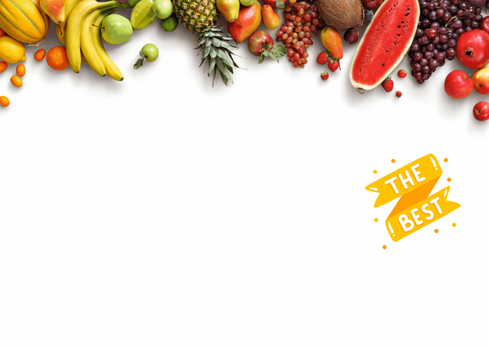
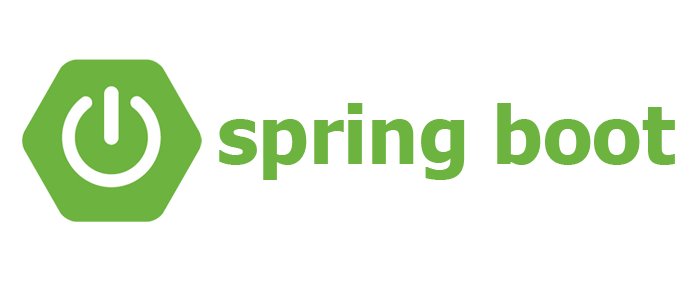
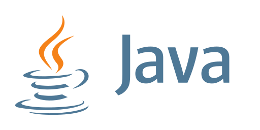

# SpringFreshFruitPOS
**Fruit Shop POS  From Maven and Spring**

### Framework Used

### Project Management Tool used

### Programing Languages

##  Support :

<a href="https://ko-fi.com/SanjayaSenanayaka">   
 
</a>

 
 

#### Credits :- *Hypertext-Assassin-RSS*
#### Started :- Jun 25, 2022

